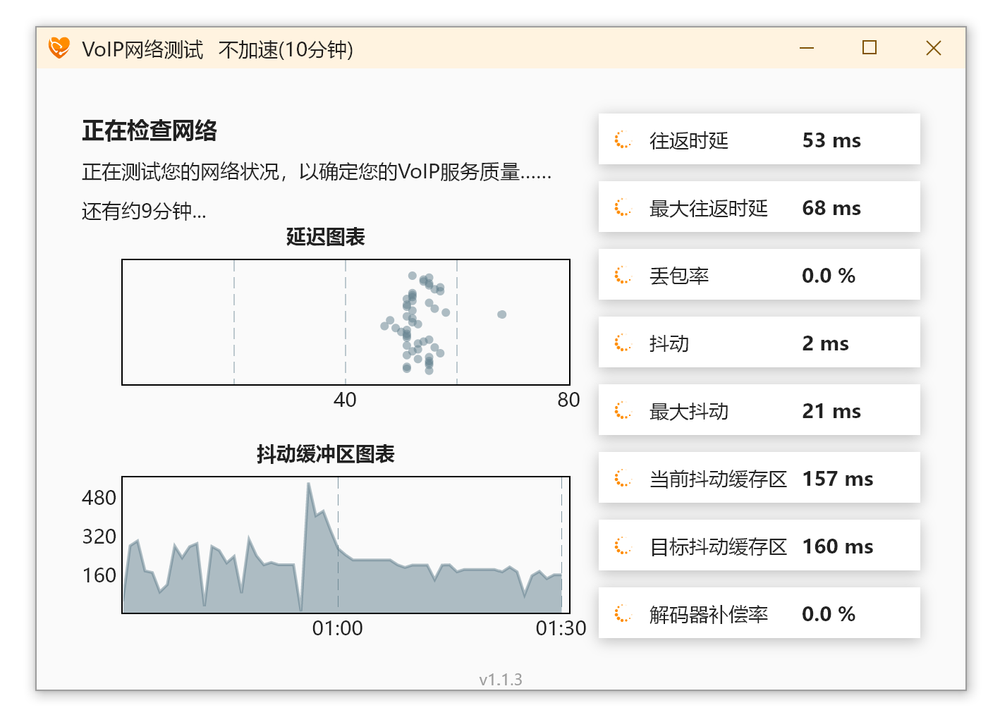
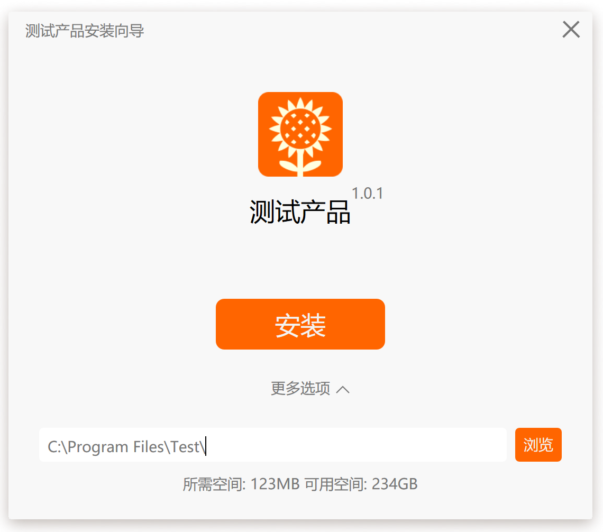
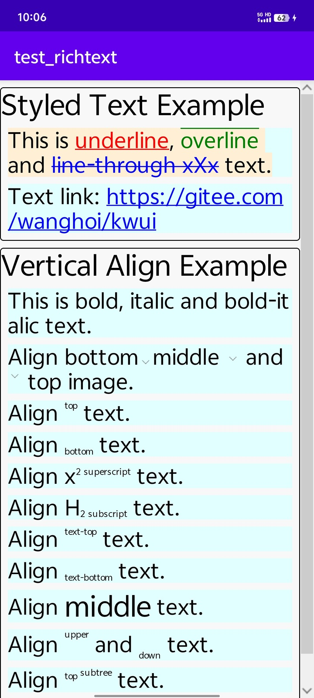
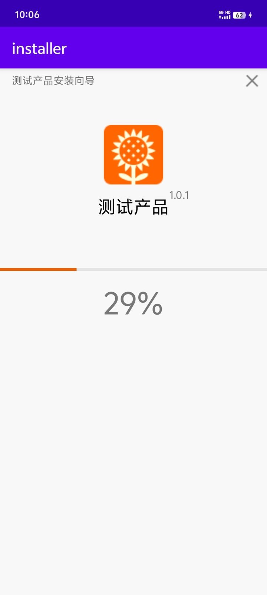

<div align="center">


# kwui

A cross-platform GUI library for Rust focused on simplicity and fast development of small tools.
Inspired by [sciter](https://sciter.com).

</div>

## Features

* Builtin JavaScript engine, and CSS parser
* React Hooks alike functional components API
* Easy interop between `Rust` and `JavaScript`
* Cross-platform support (Windows, Android)

## Documentation

- [Programming Guide](https://wanghoi.github.io)
- [Rust API References](https://docs.rs/kwui)

## FAQ

1. Why another GUI library?
- Porting server-side Rust code to client-side quickly, to explore and evaluate new technology.
- Porting tools to mobile platforms quickly.

## Example - Hello world

```javascript
import { useState } from "Keact";

function HelloWorld(props, kids) {
    let [n, setN] = useState(0);
    return <button onclick={() => setN(n + 1)}>{`Click ${n} times`}</button>;
}

app.showDialog({
    title: "Hello World",
	root: <HelloWorld />,
	stylesheet: css`
	button { margin: 10px; padding: 4px; background-color: orange; }
	button:hover { background-color: orangered; }
    `
});
```

## Gallery

### VoIP Test tool


### Remote Desktop


### Installer


### Android examples


