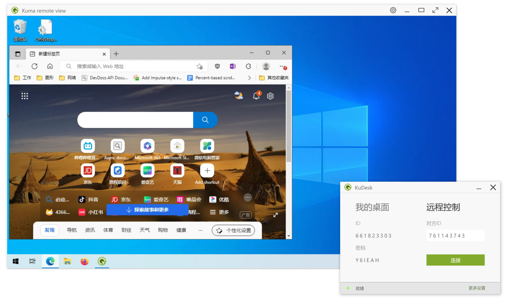

<div align="center">


# kwui-rs

A small user interface library for daily use.
Build utility Gui tool with `JSX`、`CSS` and `Rust`,
at present it is mainly supported Windows, Android and OpenHarmony support is on the way.

</div>

## Hello world

```javascript
import { useState } from "Keact";

function HelloWorld(props, kids) {
    let [n, setN] = useState(0);
    return <button onclick={() => setN(n + 1)}>{`Click ${n} times`}</button>;
}

app.showDialog({
    title: "Hello World",
	root: <HelloWorld />,
	stylesheet: css`
	button { margin: 10px; padding: 4px; background-color: orange; }
	button:hover { background-color: orangered; }
    `
});
```

## Gallery

### VoIP Test tool


### Remote Desktop


### Installer


### Android examples


## Quick Start

1. Fetch source code
```bash
git clone --recurse-submodules https://github.com/wanghoi/kwui-rs.git
```
2a. Run Win32 example
```bash
# Run the mock installer 
cargo run -p installer
```
2b. Or build Android example apk
```bash
# Setup Android development environment, Eg:
set ANDROID_HOME=D:/Android/Sdk
set ANDROID_NDK_HOME=D:/Android/Sdk/ndk/27.0.11718014
set CARGO_TARGET_AARCH64_LINUX_ANDROID_LINKER=%ANDROID_NDK_HOME%/toolchains/llvm/prebuilt/windows-x86_64/bin/aarch64-linux-android30-clang.cmd

# Build the mock installer 
cmake --preset android-debug
cmake --build --preset android-debug --target installer.APK
```

## Documentation
- [TODO: API Reference](https://github.com/wanghoi/kwui-rs/wikis)

## FAQ

1. Why another GUI library?
- Porting server-side Rust code to client-side quickly, to explore and evaluate new technology.
- Explore end-to-end and server-relay audio and video transport technology.
- Explore SDWAN technology.
